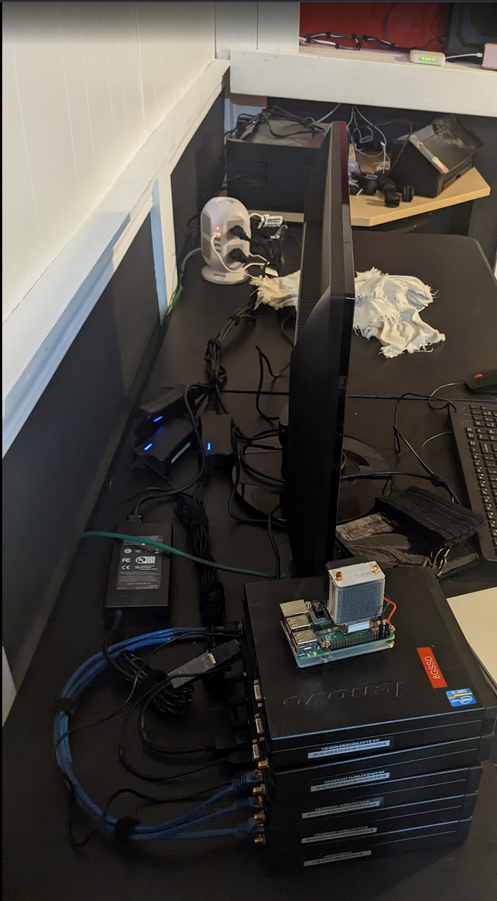
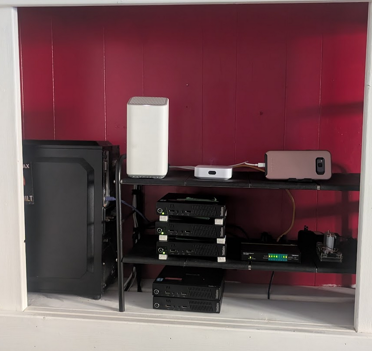

# Web Server Set-up Journal 

## 1/1/2025
> Orginally planning to build out Windows server domain, but I nee
> Spent last couple of weeks re-working approach when I was able to get 3 Mini PCs hooked up together, and found out about proxmox VE. 

> I built out a multi=node proxmox cluster by creating a single Ubntu VM with apache, confirming locaal and external access, replacing default web page, and registering a domain with working DNS despite some intitial CNAMe and wildcard issues. After cloning the CM across al 3 nodes to work towards reduncacney, I begin setting up load balancing but stopped when I realised all cloned VM's shared the same IP. I recorded, and set static IP's and domains shortyl after in Server Info. 

## 1/5/2025
> Bought a cheap shelf from Ikea for better organization of equipment. Waiting for glue to dry, then will re-setup

 > Current set up: 
 
> Started creation of git server with "source of truth", so that each web server will automatically be updated. Git server will store the repository of the main web page. 

## 1/6/2025 
> Re-organized network gear and computers on another shelf.

> After, new set up: 

## 1/7/2025
> Added Pi-Hole. Configured to router. Want to eventually add a pi hole controller button when it blocks something on web pages: https://github.com/mikeswanson/PiHoleController. 

