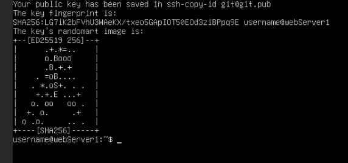
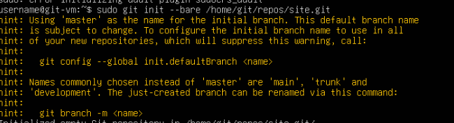
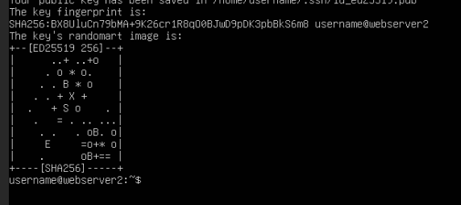
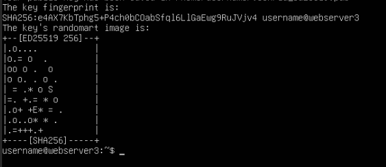

# Server Info

## HTPC
**IP:** 192.168.10.84:32400
**DNS:** htpc-plexmedia.com:32400
## Software
 - Plex Media Server
 - Surf Shark: VPN
 - Ubuntu Desktop

## Proxmox Cluster

### Main Node
Name: PVE1
**IP:**  192.168.10.92:8006 /24
**DNS:**  proxmox-cluster-pve1.com:8006
### Virtual Machines
#### Pve 1 Load Balancer
**Name:** PVE1 Web Server 
**IP:**  192.168.10.104
**DNS:** pve1-loadbalancer.com
#### PVE1 Web Server
**IP:**  192.168.10.105
**DNS:** pve1-webserver.com

#### Git Server
**IP:**  192.168.10.100
**DNS:** gitserver.com 

### Secondary Node
Name: PVE2
**IP:**  192.168.10.93:8006 /24
**DNS:**  proxmox-cluster-pve2.com:8006
### Virtual Machines
#### PVE2 Web Server
**Name:** PVE2 Web Server 
**IP:**  192.168.10.102
**DNS:** pve2-webserver.com

#### PVE2 Web Server
**Name:** PVE2 Load Balancer
**IP:**  192.168.10.102
**DNS:** pve2-load-balancer.com

### Secondary Node
Name: PVE3
**IP:**  192.168.10.94:8006 /24
**DNS:**  proxmox-cluster-pve3.com:8006
### Virtual Machines
#### PVE3 Web Server
**Name:** PVE3 Web Server 
**IP:**  192.168.10.103
**DNS:** pve3-webserver.com:8006

gitserver.com
	
Host (A)
	
192.168.10.100
htpc-plexmedia.com
	
Host (A)
	
192.168.10.84
pi-hole.com
	
Host (A)
	
192.168.10.99
proxmox-cluster-pve1.com
	
Host (A)
	
192.168.10.92
proxmox-cluster-pve2.com
	
Host (A)
	
192.168.10.93
proxmox-cluster-pve3.com
	
Host (A)
	
192.168.10.94
pve1-loadbalancer.com
	
Host (A)
	
192.168.10.104
pve1-webserver.com
	
Host (A)
	
192.168.10.105
pve2-webserver.com
	
Host (A)
	
192.168.10.102
pve3-webserver.com
	
Host (A)
	
192.168.10.103
